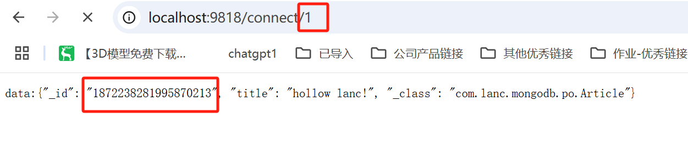
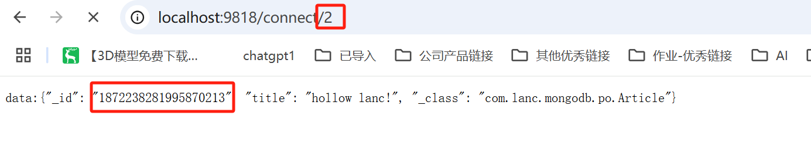
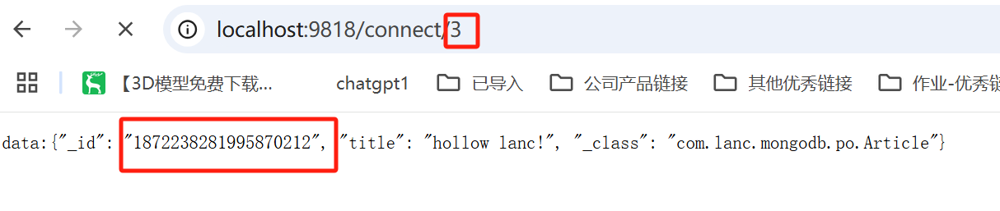
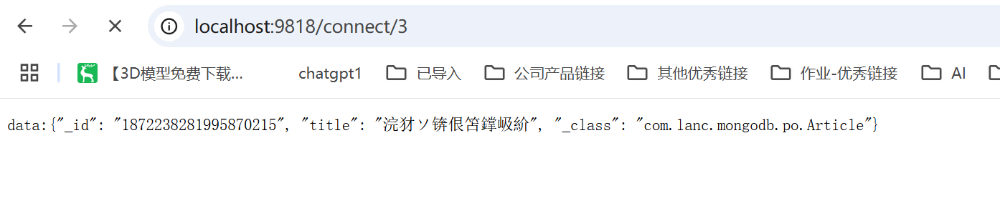
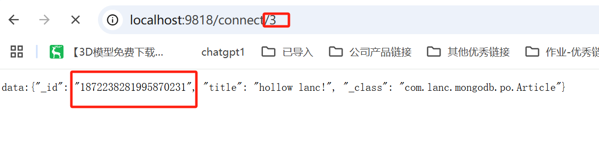
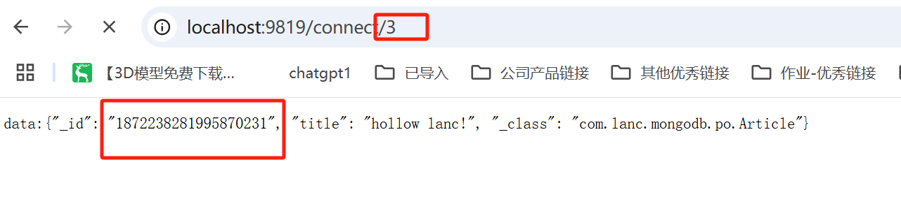
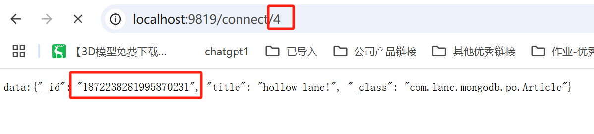

```shell
# 删除容器和卷
docker-compose down
docker volume prune
docker volume rm root_mongo1-data root_mongo2-data root_mongo3-data

# 创建目录
mkdir mongo
cd mongo/
vim docker-compose.yml

# 创建log和data目录
mkdir -p /root/mongo/mongo1-logs
mkdir -p /root/mongo/mongo1-data
mkdir -p /root/mongo/mongo2-logs
mkdir -p /root/mongo/mongo2-data
mkdir -p /root/mongo/mongo3-logs
mkdir -p /root/mongo/mongo3-data
chmod +x /root/mongo/mongo1-logs
chmod +x /root/mongo/mongo1-data
chmod +x /root/mongo/mongo2-logs
chmod +x /root/mongo/mongo2-data
chmod +x /root/mongo/mongo3-logs
chmod +x /root/mongo/mongo3-data
```

docker-compose.yml
```shell
version: '3.8'

services:
  mongo1:
    image: mongo:6.0
    container_name: mongo1
    hostname: mongo1
    restart: always
    ports:
      - 27017:27017 # 主机端口映射到 mongo1 的 27017
    command: ["mongod", "--replSet", "rs0", "--bind_ip_all"]
    volumes:
      - mongo1-data:/data/db
      - mongo1-logs:/var/log/mongodb
    healthcheck:
      test: ["CMD", "mongo", "--eval", "db.adminCommand('ping')"]
      interval: 10s
      timeout: 10s
      retries: 5

  mongo2:
    image: mongo:6.0
    container_name: mongo2
    hostname: mongo2
    restart: always
    ports:
      - 27018:27017 # 主机端口 27018 映射到 mongo2 的 27017
    command: ["mongod", "--replSet", "rs0", "--bind_ip_all"]
    volumes:
      - mongo2-data:/data/db
      - mongo2-logs:/var/log/mongodb
    healthcheck:
      test: ["CMD", "mongo", "--eval", "db.adminCommand('ping')"]
      interval: 10s
      timeout: 10s
      retries: 5

  mongo3:
    image: mongo:6.0
    container_name: mongo3
    hostname: mongo3
    restart: always
    ports:
      - 27019:27017 # 主机端口 27019 映射到 mongo3 的 27017
    command: ["mongod", "--replSet", "rs0", "--bind_ip_all"]
    volumes:
      - mongo3-data:/data/db
      - mongo3-logs:/var/log/mongodb
    healthcheck:
      test: ["CMD", "mongo", "--eval", "db.adminCommand('ping')"]
      interval: 10s
      timeout: 10s
      retries: 5

volumes:
  mongo1-data:
    driver: local
    driver_opts:
      type: none
      o: bind
      device: /root/mongo/mongo1-data
  mongo1-logs:
    driver: local
    driver_opts:
      type: none
      o: bind
      device: /root/mongo/mongo1-logs
  mongo2-data:
    driver: local
    driver_opts:
      type: none
      o: bind
      device: /root/mongo/mongo2-data
  mongo2-logs:
    driver: local
    driver_opts:
      type: none
      o: bind
      device: /root/mongo/mongo2-logs
  mongo3-data:
    driver: local
    driver_opts:
      type: none
      o: bind
      device: /root/mongo/mongo3-data
  mongo3-logs:
    driver: local
    driver_opts:
      type: none
      o: bind
      device: /root/mongo/mongo3-logs

```

```shell
# 启动容器
docker-compose up -d

# 进入容器
docker exec -it mongo1 mongosh

# 初始化副本集
rs.initiate({
    _id: "rs0",
    members: [
        { _id: 0, host: "lanc.com:27017" },
        { _id: 1, host: "lanc.com:27018" },
        { _id: 2, host: "lanc.com:27019" }
    ]
})

# 查看副本集状态
rs.status()
```

测试办法：


注意，同一个clientId同时连接会被覆盖


多个节点测试



